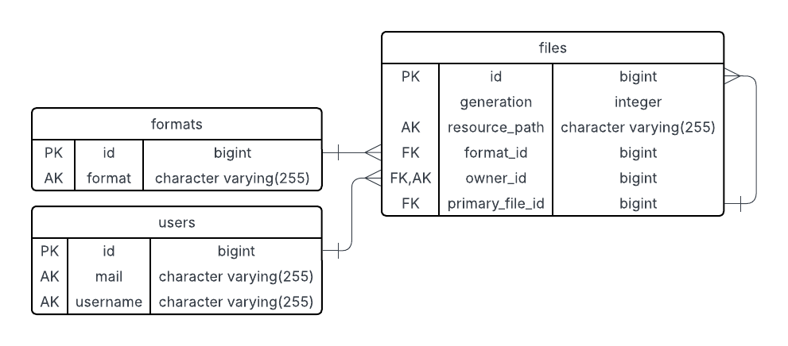

# Spring Boot REST API

A Spring Boot 3 REST API.

- **Java**: 17
- **Spring Boot**: 3.5.4
- **Build**: Maven
- **DB**: PostgreSQL
- **Base URL**: `http://localhost:8080`

## About AWS configuration

To enable the connection with AWS S3, you need to be logged in prepared account. You need credentials to this profile. Probably you will get file named: account_name_credentials.csv. Inside of it you have 3 columns. Username, password and url. Now ensure that you have aws-cli installed on your system:

```bash
    aws --version
```

Then you have to log in AWS website using url, username and password. Afterwards enter IAM->Users->your_account->create_access_key. With downloaded .csv you can log into cli using:

```bash
aws configure
```

Congratulations.

---

## Quick Start

After running database:

```bash
    mvn clean package
    mvn spring-boot:run -Dspring-boot.run.profiles=dev
```

Or if you want to ensure safety of data on db: (probably only for tests)

```bash
    mvn clean package
    mvn spring-boot:run -Dspring-boot.run.profiles=test
```

## Useful commands:

Before commit use fmt formatter in root:

```bash
    mvn fmt:format
```

## ER Diagram


Generated using https://www.lucidchart.com. Create new document from "Database ER diagram (crow's foot)" template. Then import DB.

## Endpoints

### /api/v1/users

| HTTP Method | Endpoint            | Operation description |
|-------------|---------------------|-----------------------|
| GET         | /api/v1/users       | findAll               |
| GET         | /api/v1/users/{id}  | findById              |
| PATCH       | /api/v1/users/{id}  | updateById with body  |
| POST        | /api/v1/users       | save                  |
| DELETE      | /api/v1/users/{id}  | deleteById            |

### /api/v1/stored_files

| HTTP Method | Endpoint                              | Operation description                |
|-------------|---------------------------------------|--------------------------------------|
| GET         | /api/v1/stored_files                  | findAll                              |
| GET         | /api/v1/stored_files/{id}             | findById                             |
| GET         | /api/v1/stored_files/{id}/export      | export byte stream                   |
| GET         | /api/v1/stored_files/owner/{owner_id} | find all files that belongs to owner |
| POST        | /api/v1/stored_files                  | save                                 |
| DELETE      | /api/v1/stored_files/{id}             | deleteById                           |

### /api/v1/formats

| HTTP Method | Endpoint             | Operation description |
|-------------|----------------------|-----------------------|
| GET         | /api/v1/formats      | findAll               |
| GET         | /api/v1/formats/{id} | findById              |
| POST        | /api/v1/formats      | save                  |
| DELETE      | /api/v1/formats/{id} | deleteById            |

---

## GET response bodies:

- GET /api/v1/formats/{id}

    {
      "id": 0,
      "format": "png"
    }

- GET /api/v1/formats

    Analogically

- GET /api/v1/stored_files/{id}

    {
      "ownerId": 1,
      "formatId": 1,
      "primaryFileId": null,
      "generation": 1,
      "content": "SGVsbG8sIE9DUiE=" # type = byte[]
    }

- GET /api/v1/stored_files

    Analogically

- GET /api/v1/stored_files/owner/{owner_id}

    Analogically

- GET /api/v1/stored_files/export/{id}

    ���JFIF�����C ... ��H����.�@�P�...

- GET /api/v1/users/{id}

    {
      "id": 0,
      "mail": "mail",
      "username": "username",
      "firstName": "firstName",
      "lastName": "lastName",
    }

- GET /api/v1/users

    Analogically

---

## POST requests bodies

- POST /api/v1/formats

    {
      "format":"txt1"
    }

- POST /api/v1/stored_files:

    {
      "ownerId": 1,
      "formatId": 5,
      "generation": 1,
      "primaryFileId": null,
      "content": "SGVsbG8gd29ybGQh"
    }

- POST /api/v1/users:

    {
        "id": 1,
        "mail": "archive.digitalisation@bachelor.pl",
        "username": "ad",
        "firstName": "archive",
        "lastName": "digitalisation"
    }

## Example curls: (token is dev token)

- POST on /api/v1/formats

    curl --silent --show-error --fail \
      -X POST "http://localhost:8080/api/v1/formats" \
      -H "Authorization: -----------" \
      -H "Content-Type: application/json" \
      -d '{"format":"txt1"}'

- POST on /api/v1/stored_files

    curl --silent --show-error --fail \
      -X POST "http://localhost:8080/api/v1/stored_files" \
      -H "Authorization: -----------" \
      -H "Content-Type: application/json" \
      -d '{
        "ownerId": 1,
        "formatId": 1,
        "primaryFileId": null,
        "generation": 1,
        "content": "SGVsbG8sIE9DUiE=" 
      }'

- POST on /api/v1/users

    curl --silent --show-error --fail \
      -X POST "http://localhost:8080/api/v1/users" \
      -H "Authorization: -----------" \
      -H "Content-Type: application/json" \
      -d '{
        "id": 1,
        "mail": "test1.test@test.com",
        "username": "test1.test@test.com",
        "firstName": "test1.test@test.com",
        "lastName": "test1.test@test.com"
    }'

- PATCH on /api/v1/users/1

    curl --silent --show-error --fail
      -X PATCH "http://localhost:8080/api/v1/users/1"
      -H "Authorization: -----------"
      -H "Content-Type: application/json"
      -d '{
        "mail": "archive.digitalisation@bachelor.pl",
        "username": "ad",
        "firstName": "archive",
        "lastName": "digitalisation"
    }'

Remember about NOTNULL variables. Firstly you have to have owner and format with id=1 and then adding file is possible.