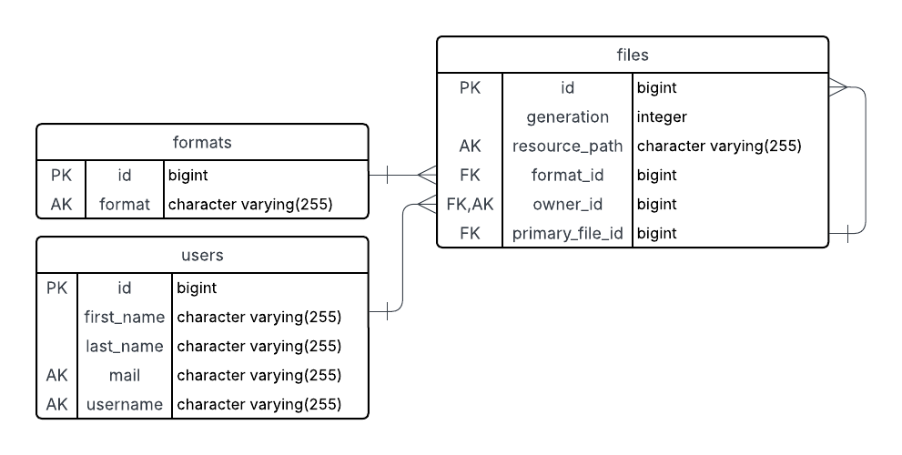

# Spring Boot REST API

A Spring Boot 3 REST API for managing **users**, **file formats**, and **files** (with simple versioning).

- **Java**: 17
- **Spring Boot**: 3.5.4
- **Build**: Maven
- **DB**: PostgreSQL
- **Base URL**: `http://localhost:8080`

---

## Quick Start

```bash
    mvn clean package
    sudo docker-compose up
```

## ER Diagram


Generated using https://www.lucidchart.com. Create new document from "Database ER diagram (crow's foot)" template. Then import DB.

## Endpoints

### /api/v1/users

| HTTP Method | Endpoint            | Operation description |
|-------------|---------------------|-----------------------|
| GET         | /api/v1/users       | findAll               |
| GET         | /api/v1/users/{id}  | findById              |
| POST        | /api/v1/users       | save                  |
| DELETE      | /api/v1/users/{id}  | deleteById            |

### /api/v1/stored_files

| HTTP Method | Endpoint                              | Operation description                |
|-------------|---------------------------------------|--------------------------------------|
| GET         | /api/v1/stored_files                  | findAll                              |
| GET         | /api/v1/stored_files/{id}             | findById                             |
| GET         | /api/v1/stored_files/owner/{owner_id} | find all files that belongs to owner |
| POST        | /api/v1/stored_files                  | save                                 |
| DELETE      | /api/v1/stored_files/{id}             | deleteById                           |

### /api/v1/formats

| HTTP Method | Endpoint             | Operation description |
|-------------|----------------------|-----------------------|
| GET         | /api/v1/formats      | findAll               |
| GET         | /api/v1/formats/{id} | findById              |
| POST        | /api/v1/formats      | save                  |
| DELETE      | /api/v1/formats/{id} | deleteById            |

---

- /api/v1/stored_files:

Send files in format:

{
  "ownerId": 1,
  "formatId": 5,
  "generation": 1,
  "primaryFileId": null,
  "content": "SGVsbG8gd29ybGQh"
}
